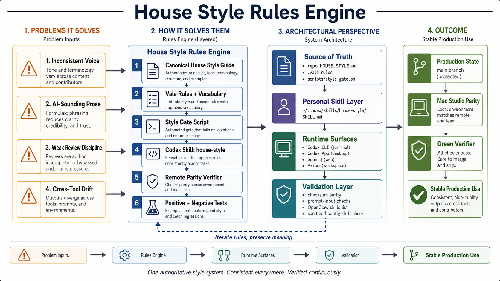

# House Style System

A practical starter system for clearer, more trustworthy AI-assisted writing.

The goal is simple: keep human judgment in the writing loop.

This repo gives you a working house style guide, a small Vale style gate, test fixtures, and examples you can use immediately. Start with the defaults. Then tune the rules to your own voice, audience, and risk.



## What This Is

House Style System is a lightweight writing quality framework.

It helps writers and teams:

- make writing clearer,
- reduce generic AI-sounding prose,
- separate facts from assumptions,
- define what automation checks,
- define what human review owns,
- test style rules with examples.

## What This Is Not

This is not an AI detector.

It does not prove whether a person or model wrote a sentence. It does not score authorship. It does not help disguise AI use.

Style signals are review prompts. They are not proof.

## Quick Start

Install Vale:

```sh
brew install vale
```

Run the style gate:

```sh
./scripts/style_gate.sh HOUSE_STYLE.md docs/examples.md
```

Run the fixture test:

```sh
./scripts/test-style-gate.sh
```

Use `HOUSE_STYLE.md` as your starter standard. Edit the rules, examples, and fixtures as your own house style becomes clearer.

## Repo Map

```text
house-style-system/
├── README.md
├── HOUSE_STYLE.md
├── assets/
│   └── house-style-rules-engine-map.png
├── docs/
│   ├── ai-authorship-boundary.md
│   ├── customizing.md
│   ├── domain-modes.md
│   ├── examples.md
│   ├── house-style-system.md
│   └── test-fixtures/style-gate/
├── research/
│   └── house-style-taxonomy-assessment-public.docx
├── scripts/
│   ├── style_gate.sh
│   └── test-style-gate.sh
├── styles/
│   └── HouseStyle/
└── .vale.ini
```

## The Default Operating Rule

Automation owns repeatable checks.

Human review owns truth, evidence, and judgment. It also owns recommendation quality and tone.

That boundary matters. A clean style gate means the text avoided known style risks. It does not prove the writing is true, useful, or ready to publish.

## How To Use This With AI

1. Draft with AI when it helps.
2. Read every line.
3. Cut anything you are not willing to stand behind.
4. Check facts, assumptions, sources, and recommendations.
5. Run the style gate.
6. Fix warnings that weaken clarity or trust.
7. Add new examples when you see the same failure twice.

## Public-Safe Defaults

The default rules are conservative. They flag common writing risks:

- filler phrases,
- weak modifiers,
- jargon,
- em dashes,
- stock conclusions,
- overloaded sentences,
- undefined acronym candidates,
- repeated contrast scaffolding.

Warnings are meant to slow you down, not force mechanical rewrites.

## Customize It

Your house style should reflect your readers and your work.

Start by changing:

- the jargon list,
- preferred replacements,
- domain-mode checks,
- fixture examples,
- warning levels.

See [docs/customizing.md](docs/customizing.md).

## Research Note

The public research artifact is in [research/house-style-taxonomy-assessment-public.docx](research/house-style-taxonomy-assessment-public.docx). It explains the style-risk taxonomy behind this system and credits the research, synthesis, and AI-collaboration process used to prepare the assessment.

## License

MIT. See [LICENSE](LICENSE).
